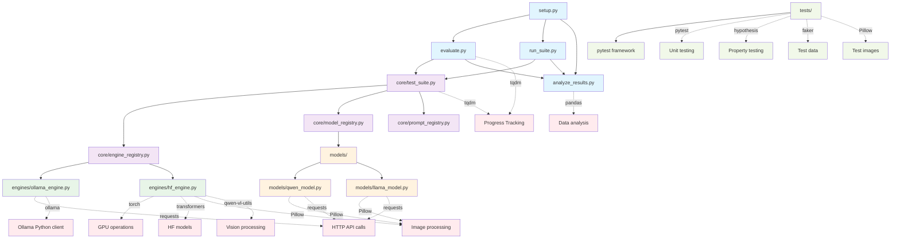

```mermaid
graph TD
    %% Entry Points
    A[setup.py] --> B[evaluate.py]
    A --> C[run_suite.py]
    A --> D[analyze_results.py]

    %% Main Flow
    B --> E[core/test_suite.py]
    C --> E

    %% Core Framework
    E --> F[core/engine_registry.py]
    E --> G[core/model_registry.py]
    E --> H[core/prompt_registry.py]

    %% Engine Selection
    F --> I[engines/ollama_engine.py]
    F --> J[engines/hf_engine.py]

    %% Model Layer
    G --> K[models/]
    K --> L[models/qwen_model.py]
    K --> M[models/llama_model.py]

    %% Results Analysis
    B --> D
    C --> D

    %% Testing
    N[tests/] --> O[pytest framework]

    %% Library Usage Annotations
    B -.->|tqdm| P[Progress Tracking]
    E -.->|tqdm| P

    I -.->|requests| Q[HTTP API calls]
    I -.->|ollama| R[Ollama Python client]

    J -.->|torch| S[GPU operations]
    J -.->|transformers| T[HF models]
    J -.->|Pillow| U[Image processing]
    J -.->|qwen-vl-utils| V[Vision processing]

    L -.->|Pillow| U
    M -.->|Pillow| U
    L -.->|requests| Q
    M -.->|requests| Q

    D -.->|pandas| W[Data analysis]

    N -.->|pytest| X[Unit testing]
    N -.->|hypothesis| Y[Property testing]
    N -.->|faker| Z[Test data]
    N -.->|Pillow| AA[Test images]

    %% Component Styling
    classDef entryPoint fill:#e1f5fe
    classDef core fill:#f3e5f5
    classDef engine fill:#e8f5e8
    classDef model fill:#fff3e0
    classDef library fill:#ffebee
    classDef testing fill:#f1f8e9

    class A,B,C,D entryPoint
    class E,F,G,H core
    class I,J engine
    class K,L,M model
    class P,Q,R,S,T,U,V,W library
    class N,O,X,Y,Z,AA testing
```